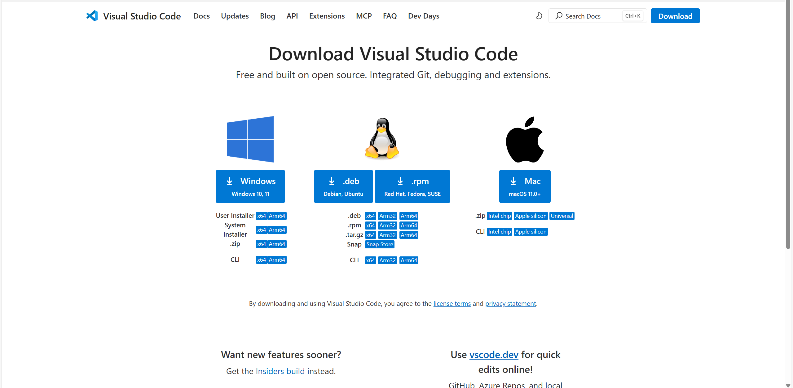
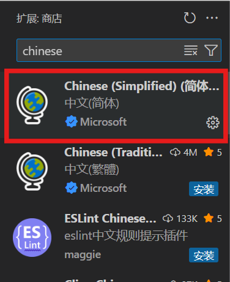
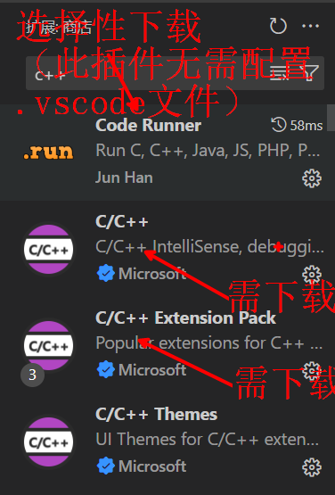
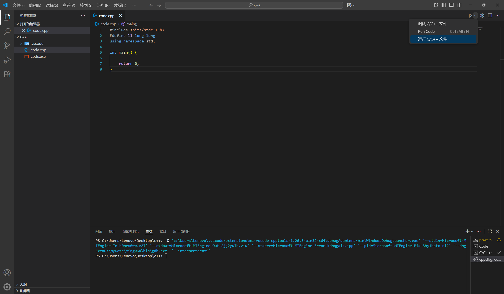

# vscode c++ 配置

## 配置方法

1. 安装[vscode](https://code.visualstudio.com/Download)
    
2. 安装简体中文语言包
   
3. 安装C/C++插件
   
4. 安装[mingw](https://github.com/writer-liu/vscode-cpp-config/releases/download/vscode_1/x86_64-14.2.0-release-win32-seh-ucrt-rt_v12-rev2.7z)
5. 配置系统环境

   - 右键此电脑 -> 属性 -> 高级系统设置 -> 环境变量
   - 在系统变量中找到Path，双击，点击新建，添加`mingw`的`bin`目录，如：`D:\myDate\mingw64\bin`
   - 或运行[add_mingw_to_path.bat](https://github.com/writer-liu/vscode-cpp-config/releases/download/vscode_1/add_mingw_to_path.bat)
6. 配置.vscode 文件夹  **下载了`code runner`插件，可直接运行`.cpp`，无需配置**

   - 下载`.vscode`文件夹
   - 对`c_cpp_properties.json`、`launch.json`、`tasks.json`进行配置

   `c_cpp_properties.json`

   ```javascript
   {
       "configurations": [
           {
               "name": "Win32",
               "includePath": [
                   "${workspaceFolder}/**"
               ],
               "defines": [
                   "_DEBUG",
                   "UNICODE",
                   "_UNICODE"
               ],
               "cStandard": "c23",
               "cppStandard": "c++23",
               "intelliSenseMode": "windows-gcc-x64",
               "compilerPath": "D:/myDate/mingw64/bin/g++.exe" // 更改为你的`编译器路径`
           }
       ],
       "version": 4
   }
   ```
   `launch.json`

   ```javascript
   {
       "configurations": [
           {
               "name": "C/C++: g++.exe 构建和调试活动文件",
               "type": "cppdbg",
               "request": "launch",
               "program": "${fileDirname}\\${fileBasenameNoExtension}.exe",
               "args": [],
               "stopAtEntry": false,
               "cwd": "${fileDirname}",
               "environment": [],
               "externalConsole": false,
               "MIMode": "gdb",
               "miDebuggerPath": "D:\\myDate\\mingw64\\bin\\gdb.exe", // // 更改为你的`编译器路径`
               "setupCommands": [
                   {
                       "description": "为 gdb 启用整齐打印",
                       "text": "-enable-pretty-printing",
                       "ignoreFailures": true
                   }
               ],
               "preLaunchTask": "C/C++: g++.exe 生成活动文件"
           }
       ],
       "version": "2.0.0"
   }
   ```
   `tasks.json`

   ```javascript
   {
       "tasks": [
           {
               "type": "cppbuild",
               "label": "C/C++: g++.exe 生成活动文件",
               "command": "D:\\myDate\\mingw64\\bin\\g++.exe", // 更改为你的`编译器路径`
               "args": [
                   "-fdiagnostics-color=always",
                   "-g",
                   "${file}",
                   "-o",
                   "${fileDirname}\\${fileBasenameNoExtension}.exe"
               ],
               "options": {
                   "cwd": "${fileDirname}"
               },
               "problemMatcher": [
                   "$gcc"
               ],
               "group": "build",
               "detail": "调试器生成的任务。"
           }
       ],
       "version": "2.0.0"
   }
   ```
7. 重启`vscode`，打开一个`.cpp`文件，按`F5`，选择`C/C++: g++.exe 构建和调试活动文件`，即可运行调试
    